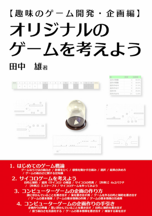
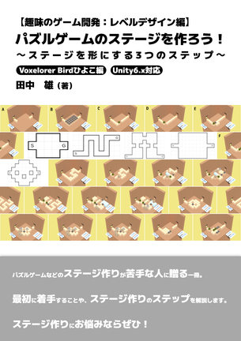

- 田中　雄
- 連絡先 Bluesky [@am1tanaka](https://am1tanaka.bsky.social) / E-mail [yutanaka@am1.jp](mailto:yutanaka@am1.jp)

## 資格

- 第一種情報処理技術者試験合格
- 第二種情報処理技術者試験合格
- 普通自動車第一種免許

## スキル

- C#
  - 利用歴10年以上
  - Unityで利用
- Unity
  - 利用歴10年以上
  - オリジナルの個人/チーム作品の開発経験あり

## 取り組んでいるテーマ

1. オリジナルゲーム開発
1. 同人技術書執筆

## 2025年度活動

- [技術書典18](https://techbookfest.org/event/tbf18)出展 5/31-6/15
- [Kenney Jam 2025](https://itch.io/jam/kenney-jam-2025)参加 7/19-7/21
- [デジゲー博2025](https://digigame-expo.org/)出展 11/9
- [技術書典19](https://techbookfest.org/event/tbf19)出展 11/15-11/30

## 作品リスト

### 【趣味のゲーム開発:企画編】オリジナルのゲームを考えよう

[【趣味のゲーム開発:企画編】オリジナルのゲームを考えよう](https://techbookfest.org/product/2FY5JrstKxtB7xj9DJrXjc)

趣味のゲーム作りの本です。本書では、サイコロを使った簡単なアナログゲームや、コンピューターゲームの企画の制作方法を紹介します。

- 執筆環境：Re:VIEW
- 執筆期間：2025/2/3-5/21
- [技術書典18](https://techbookfest.org/event/tbf18) 初出

### Power Jump & Power Kick!!

[Power Jump & Power Kick!!](https://am1tanaka.itch.io/pwjp-pwkick)

マウスボタンを押してジャンプ力やキック力をチャージします。箱をキックして壊して進むサイドビューアクションゲーム！

- 開発環境：Godot Engine 4.4.1(GDScript)
- 開発期間：2025/7/18-7/23
- [Kenney Jam 2025](https://itch.io/jam/kenney-jam-2025/rate/3732542) 参加作品

### Unity AIベータ版を使ってみよう！

[Unity AIベータ版を使ってみよう！](https://techbookfest.org/product/ng8nivKLjuzBDvjTf6DnE3)

Unity6.2からエディターに統合されたUnity AIのうち、チャット形式でAIを使うAssistantと、各種アセットをAIで生成するGeneratorsの手引書です。

- 執筆環境：Re:VIEW
- 執筆期間：2025/8/20-10/21
- [技術書典19](https://techbookfest.org/event/tbf19) 初出

### 趣味のゲーム開発:レベルデザイン編　パズルゲームのステージを作ろう！

[趣味のゲーム開発:レベルデザイン編　パズルゲームのステージを作ろう！](https://techbookfest.org/product/sKwmakVFbxLyqti7Kw6sav)

- 執筆環境：Re:VIEW
- 執筆期間：2025/9/24-11/1
- [技術書典19](https://techbookfest.org/event/tbf19) 初出

## 連絡先
- Webサイト [FROM RIVERSIDE](https://am1.jp)
- ブログ [tanaka's Programming Memo](https://am1tanaka.hatenablog.com/)
- Bluesky [@am1tanaka](https://am1tanaka.bsky.social)
- E-mail [yutanaka@am1.jp](mailto:yutanaka@am1.jp)
