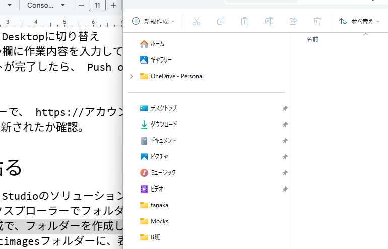

- [リンク](#リンク)

# 大見出し

## 中見出し

### 小見出し

#### 極小見出し

- 箇条書き
- 箇条書き2
- 箇条書き3
  - 箇条書きのインデント
    - 箇条書きインデント

1. ナンバリング
1. 1.のままで大丈夫
1. 自動的に数えてくれる

[リンク](https://github.com/datgm25/design)

a

a

a

a

a

a

a

a

## リンク

リンク
